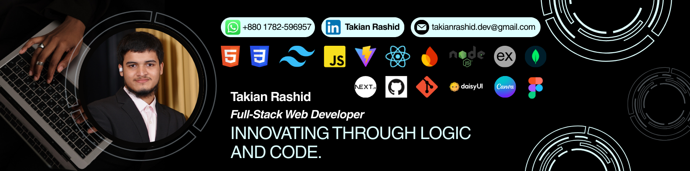

# Hi, I'm Takian Rashid 👋

### Full-Stack Developer | MERN Stack Specialist | International A-Level Student @ Sylhet International School & College

---

---

## 🚀 About Me: Building Scalable & Interactive Applications
I am a dedicated **Full-Stack Web Developer** with a solid foundation in the **MERN** (MongoDB, Express, React, Node.js) stack. My goal is to build interactive, high-performance, and scalable applications.

My practical skills were honed through the **Programming Hero Complete Web Development Bootcamp**, where I gained hands-on expertise in:
* **Full-Stack Development**
* **Modern UI Frameworks** (React, Next.js)
* **RESTful APIs & Backend Architecture**
* **Authentication & Security** (Firebase, JWT)

I bring a unique analytical perspective from my **Full-Stack Web Development** experience and my **STEM-focused International A-Level studies (Mathematics, Physics & Accounting)** at **Sylhet International School & College.** This emphasizes problem-solving, efficient coding, and practical application of emerging technologies.  

I am actively seeking **Full-Stack Web Developer** roles where I can contribute my technical skills, tutoring experience, and passion for continuous learning.

---

## 🛠️ My Professional Skill Stack

Showcasing proficiency in the entire development lifecycle, from robust backend services to modern user interfaces.

| Category | Technologies |
| :--- | :--- |
| **Frontend** |  **React** $\cdot$  **Next.js** $\cdot$  **Vite** $\cdot$  **JavaScript** $\cdot$  HTML5 $\cdot$  CSS3 |
| **Backend/Runtime** |  **Node.js** $\cdot$  **Express.js** |
| **Databases** |  **MongoDB** $\cdot$  Firebase |
| **Styling** |  **Tailwind CSS** $\cdot$  **DaisyUI** |
| **Tools/Other** |  Git $\cdot$  GitHub $\cdot$  Figma $\cdot$  Canva |

---

## 🎯 Current Focus & Future Goals

* **Mastering Next.js:** Deep dive into Server-Side Rendering (SSR), Static Site Generation (SSG), and API Routes for optimal performance.
* **Python Exploration:** Planning to integrate **Python** and frameworks like Django/Flask into my backend repertoire.
* **Cloud Services:** Gaining experience with **AWS** or **Azure** for application deployment and scaling.
* **Career Goal:** Aspiring **Software Engineer**, building full-stack, efficient, and scalable applications.

---

## 📈 GitHub Activity & Contributions

> *"My activity reflects consistent engagement with the development process, focusing on learning and project completion."*

| Stats | Languages | Streak |
| :---: | :---: | :---: |
|  |  |  |

---

## 📧 Connect With Me

| Platform | Link/Contact |
| :--- | :--- |
| **LinkedIn** | [linkedin.com/in/mdtakianrashid](https://www.linkedin.com/in/mdtakianrashid/) |
| **Email (Professional)** | takianrashid.dev@gmail.com |
| **Phone/WhatsApp** | +880 1782-596957 |
